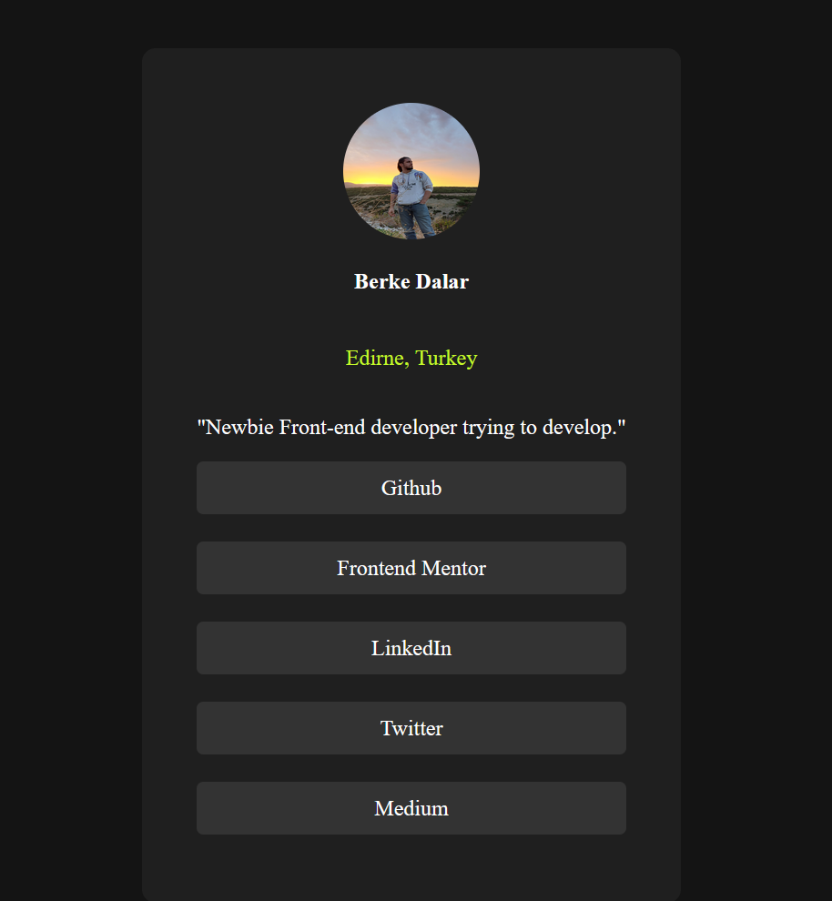

# Frontend Mentor - Social links profile solution

This is a solution to the [Social links profile challenge on Frontend Mentor](https://www.frontendmentor.io/challenges/social-links-profile-UG32l9m6dQ). Frontend Mentor challenges help you improve your coding skills by building realistic projects. 

## Table of contents

- [Overview](#overview)
  - [The challenge](#the-challenge)
  - [Screenshot](#screenshot)
  - [Links](#links)
- [My process](#my-process)
  - [Built with](#built-with)
  - [What I learned](#what-i-learned)
  - [Continued development](#continued-development)
  - [Useful resources](#useful-resources)
- [Author](#author)
- [Acknowledgments](#acknowledgments)

## Overview

### The challenge

Users should be able to:

- See hover and focus states for all interactive elements on the page

### Screenshot

### Links

- Solution URL: [Add solution URL here](https://github.com/jariwarlord/SocialLinks)
- Live Site URL: [Add live site URL here](https://social-links-one-flax.vercel.app/)

## My process

### Built with

- Semantic HTML5 markup
- CSS custom properties
- Flexbox
- CSS Grid
- Mobile-first workflow

### What I learned

Different design methods and responsive design with pure html & css, it broaden my mind about front-end technologies.
To see how you can add code snippets, see below:

body{
    display: flex;
    flex-direction: column;
    justify-content: center;
    align-items: center;
    background-color: hsl(0, 0%, 8%);
    height: 100vh;
    
}
.container{
    padding: 20px;
    margin-top: 15% auto;
    margin: 0;
    display: flex;
    flex-direction: column;
    color: white;
    background-color: hsl(0, 0%, 12%);
    align-items: center;
    max-width: 400px;
    border-radius: 10px;
}
.button-container{
    display: flex;
    flex-direction: column;
    gap: 10px;
    width: 100%;
    max-width: 400px;
    background-color: hsl(0, 0%, 12%);
    border-radius: 5px;

}
.button{
    padding: 10px;
    text-align: center;
    display: block;
    text-decoration: none;
    color: white;
    flex-direction: column;
    background-color: hsl(0, 0%, 20%);
    border-radius: 5px;
    margin-bottom: 10px;
}
it teaach me how to fit components in different resolutions.

### Continued development

### Useful resources

- [Example resource 1](https://www.example.com) - This helped me for XYZ reason. I really liked this pattern and will use it going forward.
- [Example resource 2](https://www.example.com) - This is an amazing article which helped me finally understand XYZ. I'd recommend it to anyone still learning this concept.

## Author

- Website - [Berke Dalar ](https://medium.com/@berkedalar4)
- Frontend Mentor - [@jariwarlord](https://www.frontendmentor.io/profile/jariwarlord)
- Twitter - [@berkedalar4](https://x.com/berkedalar4)

## Acknowledgments

This is where you can give a hat tip to anyone who helped you out on this project. Perhaps you worked in a team or got some inspiration from someone else's solution. This is the perfect place to give them some credit.
